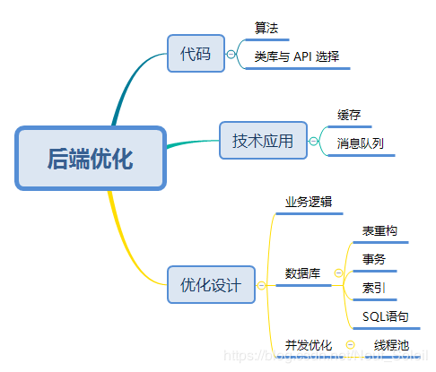

用户进入前端登录界面，输入账号密码等，输入完成之后前端发送请求到后端(拦截器不会拦截登录请求)，后端验证账号密码等成功之后生成Token并存储到数据库，
数据库中包含该Token过期时间，然后返回生成的Token到前端。前端收到Token，表示登录成功，把这个Token存储到浏览器Cookie中。然后跳转到用户中心页面，
用户中心页面从浏览器Cookie中扣出Token，跟随请求用户数据接口一起带到后端。
后端通过拦截器拦截到这个请求，去判断这个Token是否有效，有效就放过去做他该做的事情，无效就抛出异常。

DROP TABLE IF EXISTS `user`;
CREATE TABLE `user` (
  `id` int(11) NOT NULL AUTO_INCREMENT,
  `username` char(255) DEFAULT NULL,
  `password` varchar(255) DEFAULT NULL,
  PRIMARY KEY (`id`)
) ENGINE=InnoDB AUTO_INCREMENT=3 DEFAULT CHARSET=utf8; 
!--auto_increment = 1; -- 表示自增起始大小

DROP TABLE IF EXISTS `book`;
CREATE TABLE `book` (
  `id` int(11) NOT NULL AUTO_INCREMENT,
  `cover` varchar(255) DEFAULT '',
  `title` varchar(255) NOT NULL DEFAULT '',
  `author` varchar(255) DEFAULT '',
  `date` varchar(20) DEFAULT '',
  `press` varchar(255) DEFAULT '',
  `abs` varchar(255) DEFAULT NULL,
  `cid` int(11) DEFAULT NULL,
  PRIMARY KEY (`id`),
  KEY `fk_book_category_on_cid` (`cid`),
  CONSTRAINT `fk_book_category_on_cid` FOREIGN KEY (`cid`) REFERENCES `category` (`id`) ON DELETE SET NULL ON UPDATE CASCADE
) ENGINE=InnoDB AUTO_INCREMENT=102 DEFAULT CHARSET=utf8;
!--这里注意在 book 表在 cid 上有一个外键。

DROP TABLE IF EXISTS `category`;
CREATE TABLE `category` (
  `id` int(11) NOT NULL,
  `name` varchar(255) NOT NULL,
  PRIMARY KEY (`id`)
) ENGINE=InnoDB DEFAULT CHARSET=utf8;

--------------------------------------

1.用户管理
用户信息： 显示用户的基本信息（昵称、联系方式、角色、部门等）
组织架构： 显示、配置（增删改）组织架构，一般为树结构
用户操作： 为用户分配角色（多对多）、组织架构（多对多），删除用户
用户黑白名单： 对特殊用户进行特别控制
2.角色管理
角色信息： 显示角色的基本信息（名称、权限等）
角色操作： 根据需要增删角色、为角色分配权限（多对多，按不同粒度分配，并实现权限的互斥性检验）
3.权限管理
权限一般有如下三种粒度：
菜单权限： 访问某一菜单（页面、路由）的权限
操作/功能权限： 进行某一操作或使用某一功能的权限（如删除用户的权限）
数据权限： 访问某种数据（表、字段）的权限，或对可操作数据量的控制

从开发的角度考虑，该模块的技术要点如下：
用户、角色、权限、组织架构表结构设计
用户身份验证、授权、会话管理，用户信息的加密存储
不同粒度权限的具体实现
讲道理还是挺复杂的，但我们可以利用 shiro 框架极大地简化我们的开发。

1.关于 RBAC
“用户-角色-权限”管理是 “访问控制” 的一种实现方式，更为专业的叫法为 RBAC（Role-Based Access Control），即基于角色的权限访问控制。
不少地方提到RBAC 具有三个特性，或者说支持三个原则：最小权限原则，责任分离原则和数据抽象原则。
我觉得关于 RBAC，最重要的是理解为什么要在用户和权限之间加上角色这一层，而不是直接把权限赋给用户。这个问题一点也不难，
考虑需要修改用户权限的情形，给一两个用户设置权限没什么问题，但如果有成千上万个用户需要同时获取或去除同一个权限，那可费老劲了，
但通过角色来完成这个工作就十分便捷。这实际上也是一种 “解耦” 的思路。
目前对于访问权限的控制几乎全部采用这种方式，差异在于能实现到什么程度。上面提到过权限的三种粒度：菜单权限、操作/功能权限、数据权限。
此外还有一些额外的功能，比如互斥性检验（一个角色不能同时拥有两种互斥的权限）、角色继承（新建角色时继承某一角色的权限）等。
2.Shiro简介
Java Web 可以选用的安全框架主要有两种：Spring Security 和 Shiro。
Shiro 是一个强大且易用的 Java 安全框架，可以用来实现身份验证（authentication）、授权（authorization）、加密（cryptography）和会话管理（session managment）

1.菜单权限
对菜单的权限控制是最常见的。
在后台管理中，这个菜单通常表现为一个单独的页面，拥有自己的 URL 或路由。假如我想控制用户对不同页面的访问，应该怎么做呢？
使用 “全局前置守卫”（router.beforeEach），在导航触发时向后端发送一个包含用户信息的请求
后端查询数据库中该用户可以访问的菜单（也就是 vue 的路由信息）并返回
前端把接收到的数据添加到路由里，并根据新的路由表动态渲染出导航栏，使不同用户登录后看到不同的菜单。同时，由于路由表也是按需加载的，
所以用户也无法通过 URL 访问没有权限的页面
这是前后端分离的思路，传统项目实现起来更为简单：
利用过滤器，如果用户有权限则返回需要访问的页面，没有则返回未授权页面
菜单的动态渲染利用模板的常规功能即可实现，与 Vue 类似
2.功能权限
所谓功能，反映在前端就是一个组件，比如按钮或图表，在后端就是一个接口。其实现逻辑与对菜单的控制类似，只是触发的时机不同。
思路一： 按权限加载组件。即在渲染页面前向后端发送请求，获取有权限使用的组件并动态渲染，并在需要调用后端接口时进行判断，防止用户通过自行构造请求的方式绕过限制
思路二： 不管三七二十一前端组件全部加载出来，但需要调用后端接口时进行判断，如果无权限则弹出相应提示。这种适合对按钮的控制，图表直接不加载数据就显得不是很友好
3.数据权限
之前提到过，数据权限也有两个层次，一是对可访问性的控制，二是对数据量的控制。
可访问性可以针对表、字段或满足某些条件的数据。针对表、字段的控制，主要依靠在业务逻辑执行前进行判断，比如在调用对收支信息表的查询前判断当前用户是否具有财务权限。
而访问特定数据，可以直接通过 SQL 语句（WHERE 条件）来实现，比如当前用户只能查询出自身拥有的书籍，就可以通过类似 SELECT * FROM book WHERE uid = #{uid} 的语句来实现。
对数据量的控制比较五花八门，常见的比如一天内普通用户只能访问 2000 条数据（公众号好像就有这个限制），可以通过引入计数机制来实现，调用接口或执行业务逻辑时先进行判断，
同时限制本次查询的最大数量。此外，还有需要对一次的访问量进行控制、对某段时间能够处理的数据量进行控制等应用场景等等，不再赘述。

一、用户信息加密
之前我们的用户信息都是明文存储在数据库中的，这样做有两大弊端：
第一，不安全，之前有很多应用被脱裤后用户密码全网流传，救都救不回来，就是因为采用了这种设计
第二，你想啊，用户肯定也不愿意让咱们知道他的密码啊，所以咱就得想个办法忽悠一下他们，跟他们说诶你看你密码我们这儿也见不着，而且还破解不了，
所以你不用担心我们能上你号（我上不了你号，但是你号上有啥我都知道。。。）
第三，如果用户有在各个应用使用相同密码的习惯，那完了，一个地方密码被盗一串号都没了。
所以，我们要对部分用户信息进行加密，主要是用于 验证 的 敏感 的信息，比如密码，而且这种加密最好是不可逆的，即明文密码只有用户知道，我们算不出来。
hash 算法（散列算法、摘要算法）即把任意长度的输入映射为固定长度的输出，比如密码 Evanniubi 变成五位的输出 kchpl，这种算法不可逆，且存在信息损失，
虽然随着时间推移，出现了字典法、彩虹表法等优化手段，但本质上想要破解还是靠穷举与瞎蒙，而且对于复杂密码来说，破解成本极高。
其实，算法本身是足够安全的，是你设置简单密码的习惯害了你。当然，随着计算机算力的提升，破解固定长度 hash 值所需的时间也会不断减少，
但 MD5 不行了我们可以用 sha256，sha256 不行了还有 sha512，想要多少位就有多少位，总能让黑客老弟吃不消 。
2.加盐加密
加盐，是提高 hash 算法的安全性的一个常用手段。其实本质就是在密码后面加一段随机的字符串，然后再 hash。下面是加盐加密与验证的逻辑：
用户注册时，输入用户名密码（明文），向后台发送请求
后台将密码加上随机生成的盐并 hash，再将 hash 后的值作为密码存入数据库，盐也作为单独的字段存起来
用户登录时，输入用户名密码（明文），向后台发送请求
后台根据用户名查询出盐，和密码组合并 hash，将得到的值与数据库中存储的密码比对，若一致则通过验证
加盐为什么能提高安全性？
我们知道一个 hash 值（输出）可以对应无数输入，如果不加盐，找到一个和明文密码 hash 结果相同的输入相对容易，但在有盐的情况下，如果不知道盐，找到这种输入的难度就是炸裂性增长。
当然，如果别人有办法拿到数据库中以 hash 值存储的密码，拿到盐的信息也是有可能的，但是由于不同用户盐不同，所以即使有很多用户使用了相同的密码，存储在数据库里的 hash 值也不同，
试图窃取信息的黑客只能一个一个的去算，这才是加盐最大的意义所在。
在加盐的基础上，我们还可以设置 hash 的迭代次数，即进行多次 hash，进一步加大破解难度，但这就属于小打小闹了。但有的系统能搞上千次迭代，牛批，我只能说有钱，我可买不起这么多服务器。。。

关于 Shiro，需要理解三个核心概念：Subject、SecurityManager 和 Realms。
Subject： “现在在与软件交互的东西”，这个东西可能是你是我，可能是第三方进程。说白了就是穿了马甲的用户类，负责存储与修改当前用户的信息和状态。
    之后你会看到，使用 Shiro 实现我们所设计的各种功能，实际上就是在调用 Subject 的 API。
SecurityManager： Subject 背后的女人，安全相关的操作实际上是由她管理的。只用在项目中配置一次，就可以忘掉她了。
Realm： 是 Shiro 和安全相关数据（比如用户信息）的桥梁，也就是说，Realm 负责从数据源中获取数据并加工后传给 SecurityManager。
    我们可以通过配置使用特定的 Realm 替代 DAO，和 JPA 类似，Realm 获取数据的方法被封装了起来，但是数据库中的表名、字段等需要与源码预定义的查询保持一致，
    所以在我们的项目中获取数据的功能仍旧可以交给 JPA 完成，Realm 只负责加工并传递这些数据。

配置的顺序如下：
创建 Realm 并重写获取认证与授权信息的方法
创建配置类，包括创建并配置 SecurityManager 等。也可以通过 web.xml 启用 Shiro 过滤器，再通过 shiro.ini 文件进行配置，不过我们并没有 web.xml。既然用了 Spring Boot，就尽情地使用 Java 类吧

可以通过在控制台输入类似window.localStorage.setItem('user', JSON.stringify({"name":"哈哈哈"}));的命令来绕过前端的 “全局前置守卫”（router.beforeEach），
所以要想真正实现登录拦截，必须在后端也判断用户是否登录以及登录的是哪个瓜皮用户，而这就需要前端向后端发送用户信息。接下来就是这个用户信息如何表示、如何存储、如何验证的问题
1.认证方案（session 与 token）
先说最简单的认证方法，即前端在每次请求时都加上用户名和密码，交由后端验证。这种方法的弊端有两个：
一，需要频繁查询数据库，导致服务器压力较大
二，安全性，如果信息被截取，攻击者就可以 一直 利用用户名密码登录（注意不是因为明文不安全，是由于无法控制时效性）
为了在某种程度上解决上述两个问题，有两种改进的方案 —— session 与 token。
【 由于HTTP协议是无状态的协议，[无状态是指协议对于事务处理没有记忆能力。缺少状态意味着如果后续处理需要前面的信息，无法确定你的本次请求和上次请求是不是你发送的]
所以服务端需要记录用户的状态时，就需要用某种机制来识具体的用户，这个机制就是Session.典型的场景比如购物车，
当你点击下单按钮时，由于HTTP协议无状态，所以并不知道是哪个用户操作的，所以服务端要为特定的用户创建了特定的Session，用用于标识这个用户，
并且跟踪用户，这样才知道购物车里面有几本书。这个Session是保存在服务端的，有一个唯一标识。在服务端保存Session的方法很多，
内存、数据库、文件都有。集群的时候也要考虑Session的转移，在大型的网站，一般会有专门的Session服务器集群，用来保存用户会话，
这个时候 Session 信息都是放在内存的，使用一些缓存服务比如Memcached之类的来放 Session。
2. 思考一下服务端如何识别特定的客户？这个时候Cookie就登场了。每次HTTP请求的时候，客户端都会发送相应的Cookie信息到服务端。
实际上大多数的应用都是用 Cookie 来实现Session跟踪的，第一次创建Session的时候，服务端会在HTTP协议中告诉客户端，需要在 Cookie 里面记录一个Session ID，
以后每次请求把这个会话ID发送到服务器，我就知道你是谁了。有人问，如果客户端的浏览器禁用了 Cookie 怎么办？一般这种情况下，
这种可以通过URL重写的方式发到服务器，即每次HTTP交互，URL后面都会被附加上一个诸如 sid=xxxxx 这样的参数，服务端据此来识别用户。
3. Cookie其实还可以用在一些方便用户的场景下，设想你某次登陆过一个网站，下次登录的时候不想再次输入账号了，怎么办？这个信息可以写到Cookie里面，
访问网站的时候，网站页面的脚本可以读取这个信息，就自动帮你把用户名给填了，能够方便一下用户。这也是Cookie名称的由来，给用户的一点甜头。
所以，总结一下：Session是在服务端保存的一个数据结构，用来跟踪用户的状态，这个数据可以保存在集群、数据库、文件中；
Cookie是客户端保存用户信息的一种机制，用来记录用户的一些信息，也是实现Session的一种方式。
为什么会有token的出现？
答：首先，session的存储是需要空间的，其次，session的传递一般都是通过cookie来传递的，或者url重写的方式；而token在服务器是可以不需要存储用户的信息的，
而token的传递方式也不限于cookie传递，当然，token也是可以保存起来的；
token的生成方式？
答：浏览器第一次访问服务器，根据传过来的唯一标识userId，服务端会通过一些算法，如常用的HMAC-SHA256算法，然后加一个密钥，生成一个token，
然后通过BASE64编码一下之后将这个token发送给客户端；客户端将token保存起来，下次请求时，带着token，服务器收到请求后，然后会用相同的算法和密钥去验证token，
如果通过，执行业务操作，不通过，返回不通过信息；
token和session的区别？
token和session其实都是为了身份验证，session一般翻译为会话，而token更多的时候是翻译为令牌；
session服务器会保存一份，可能保存到缓存，文件，数据库；同样，session和token都是有过期时间一说，都需要去管理过期时间；
其实token与session的问题是一种时间与空间的博弈问题，session是空间换时间，而token是时间换空间。两者的选择要看具体情况而定。
虽然确实都是“客户端记录，每次访问携带”，但 token 很容易设计为自包含的，也就是说，后端不需要记录什么东西，每次一个无状态请求，每次解密验证，
每次当场得出合法 /非法的结论。这一切判断依据，除了固化在 CS 两端的一些逻辑之外，整个信息是自包含的。这才是真正的无状态。 
而 sessionid ，一般都是一段随机字符串，需要到后端去检索 id 的有效性。万一服务器重启导致内存里的 session 没了呢？万一 redis 服务器挂了呢？ 
方案 A ：我发你一张身份证，但只是一张写着身份证号码的纸片。你每次来办事，我去后台查一下你的 id 是不是有效。 
方案 B ：我发给你一张加密的身份证，以后你只要出示这张卡片，我就知道你一定是自己人。 
客户端使用用户名和密码请求登录。服务端收到请求，验证用户名和密码。验证成功后，服务端会生成一个token，然后把这个token发送给客户端。
客户端收到token后把它存储起来，可以放在cookie或者Local Storage（本地存储）里。客户端每次向服务端发送请求的时候都需要带上服务端发给的token。
服务端收到请求，然后去验证客户端请求里面带着token，如果验证成功，就向客户端返回请求的数据。
利用token机制进行登录认证，可以有以下方式：
a.用设备mac地址作为token
客户端：客户端在登录时获取设备的mac地址，将其作为参数传递到服务端
服务端：服务端接收到该参数后，便用一个变量来接收，同时将其作为token保存在数据库，并将该token设置到session中。客户端每次请求的时候都要统一拦截，
将客户端传递的token和服务器端session中的token进行对比，相同则登录成功，不同则拒绝。
此方式客户端和服务端统一了唯一的标识，并且保证每一个设备拥有唯一的标识。缺点是服务器端需要保存mac地址；优点是客户端无需重新登录，
只要登录一次以后一直可以使用，对于超时的问题由服务端进行处理。
b.用sessionid作为token
客户端：客户端携带用户名和密码登录
服务端：接收到用户名和密码后进行校验，正确就将本地获取的sessionid作为token返回给客户端，客户端以后只需带上请求的数据即可。
此方式的优点是方便，不用存储数据，缺点就是当session过期时，客户端必须重新登录才能请求数据。
当然，对于一些保密性较高的应用，可以采取两种方式结合的方式，将设备mac地址与用户名密码同时作为token进行认证。
APP利用token机制进行身份认证
用户在登录APP时，APP端会发送加密的用户名和密码到服务器，服务器验证用户名和密码，如果验证成功，就会生成相应位数的字符产作为token存储到服务器中，并且将该token返回给APP端。
以后APP再次请求时，凡是需要验证的地方都要带上该token，然后服务器端验证token，成功返回所需要的结果，失败返回错误信息，让用户重新登录。
其中，服务器上会给token设置一个有效期，每次APP请求的时候都验证token和有效期。
token的存储：
token可以存到数据库中，但是有可能查询token的时间会过长导致token丢失[token 的优势是无需服务器存储！！！]
为了避免查询时间过长，可以将token放到内存中。这样查询速度绝对就不是问题了，也不用太担心占据内存，就算token是一个32位的字符串，应用的用户量在百万级或者千万级，也是占不了多少内存的。
token的加密
token是很容易泄露的，如果不进行加密处理，很容易被恶意拷贝并用来登录。加密的方式一般有：
在存储的时候把token进行对称加密存储，用到的时候再解密。文章最开始提到的签名sign：将请求URL、时间戳、token三者合并，通过算法进行加密处理。
还有一点，在网络层面上token使用明文传输的话是非常危险的，所以一定要使用HTTPS协议。】
- session
服务器接收到第一个请求时，生成 session 对象，并通过响应头告诉客户端在 cookie 中放入 sessionId
客户端之后发送请求时，会带上包含 sessionId 的 cookie
服务器通过 sessionId 获取 session ，进而得到当前用户的状态（是否登录）等信息
也就是说，客户端只需要在登录的时候发送一次用户名密码，此后只需要在发送请求时带上 sessionId，服务器就可以验证用户是否登录了。
session 存储在内存中，在用户量较少时访问效率较高，但如果一个服务器保存了几十几百万个 session 就十分难顶了。同时由于同一用户的多次请求需要访问到不同服务器，
不能简单做集群，需要通过一些策略（session sticky）来扩展，比较麻烦。
之前见过有的人把 sessionId 持久化到数据库里，只存个 id，大头还在内存里，这个操作我是看不懂的
- token
虽然 session 能够比较全面地管理用户状态，但这种方式毕竟占用了较多服务器资源，所以有人想出了一种无需在服务器端保存用户状态（称为 “无状态”）的方案，即使用 token（令牌）来做验证。
对于 token 的理解，比较常见的误区是：
生成方面，使用随机算法生成的字符串、设备 mac 地址甚至 sessionId 作为 token。虽然从字面意思上讲这些也算是“令牌”，但是毫无意义。这是真的 “没有状态” 了，
对于状态的控制甚至需要用 session 完成，那只用 session 不好吗？
验证方面，把 token 存储在 session 或数据库中，比对前端传来的 token 与存储的 token 是否一致。鬼鬼，同样的骚操作。更骚的是为了提高比对效率把 token 存储在 redis 中，
大家一看哇偶好高端好有道理，就直接采用这种方法了，甚至都懒得想 token 到底是个什么。。
简单来说，一个真正的 token 本身是携带了一些信息的，比如用户 id、过期时间等，这些信息通过签名算法防止伪造，也可以使用加密算法进一步提高安全性，
但一般没有人会在 token 里存储密码，所以不加密也无所谓，反正被截获了结果都一样。（一般会用 base64 编个码，方便传输）
在 web 领域最常见的 token 解决方案是 JWT（JSON Web Token）
token 的安全性类似 session 方案，与明文密码的差异主要在于过期时间。其作用流程也与 session 类似：
用户使用用户名密码登录，服务器验证通过后，根据用户名（或用户 id 等），按照预先设置的算法生成 token，其中也可以封装其它信息，
并将 token 返回给客户端（可以设置到客户端的 cookie 中，也可以作为 response body）
客户端接收到 token，并在之后发送请求时带上它（利用 cookie、作为请求头或作为参数均可）
服务器对 token 进行解密、验证
2.客户端存储方案 （cookie、localStorage、sessionStorage）
接下来说一下认证信息在 客户端 存储的方式。首先明确，无论是明文用户名密码，还是 sessionId 和 token，都可以用三种方式存储，即 cookie、localStorage 和 sessionStorage。
但 cookie 和 local/session Storage 分工又有所不同，cookie 可以作为传递的参数，并可通过后端进行控制，local/session Storage 则主要用于在客户端中保存数据，其传输需要借助 cookie 或其它方式完成。

通常来说，在可以使用 cookie 的场景下，作为验证用途进行传输的用户名密码、sessionId、token 直接放在 cookie 里即可。而后端传来的其它信息则可以根据需要放在 local/session Storage 中，作为全局变量之类进行处理。

shiro 的安全管理实际上是基于会话实现的，所以我们没得选，用 session 方案就可以了。网上居然还有说 shiro + token 的，唉，这个问题槽点怎么这么多。。。
subject.login()该过程会产生 session，并自动把 sessionId 设置到 cookie。
使用 postman 发一个登录请求：可以看到响应头中第一行设置的 JSESSIONID ，即 sessionId 在 tomcat 中的叫法。
靠前端实现的拦截很容易被绕过。要想实现靠谱的拦截，必须由后端验证用户登录状态。这个思路并不难，就是前端带上 sesisonId 发送请求交由后端 认证，坑爹之处主要在于前后端分离的情况下需要额外的配置解决跨域问题。
默认的情况下，跨域的 cookie 是被禁止的，后端不能设置，前端也不能发送，所以两边都要设置。

没有设置cookies存活时间，所以在关闭浏览器后，sessionId 就会消失，再次发送请求，shiro 就会认为用户已经变更。但有时我们需要保持登录状态，不然每次都要重新登录怪麻烦的，所以 shiro 提供了 rememberMe 机制。
rememberMe 机制不是单纯地设置 cookie 存活时间，而是又单独保存了一种新的状态。之所以这样设计，也是出于安全性考虑，把 “记住我” 的状态与实际登录状态做出区分，
这样，就可以控制用户在访问不太敏感的页面时无需重新登录，而访问类似于购物车、订单之类的页面时必须重新登录。
为了启用 rememberMe，我们需要修改 shiro 配置类，之后，在登录方法中设置 UsernamePasswordToken 的 rememberMe 属性，然后在拦截器中进行具体的判断逻辑（rememberme状态的进入购物车之类不给通行）

实现动态加载菜单功能的第一步，是完成根据当前用户查询出可访问菜单信息的接口。
1.表设计
基于之前讲过的 RBAC 原则，我们应该设计一张角色表，用角色去对应菜单。同时，为了建立用户与角色、角色与菜单之间的关系，又需要两张中间表。加上之前的用户表，一共需要五张表
 这里我为后台管理专属的表加上了 admin 前缀。起名是一件十分重要的事情
另外不同于之前 book 和 category 的做法，这里没有用到外键。一般决定用不用外键需要看系统对数据一致性和效率的要求哪个更突出，但是我觉得数据一致性问题都可以通过代码解决，用外键又麻烦又别扭。

因为我们使用了 JPA 做 ORM，创建 POJO 时需要注意以下几点：
windows 下默认不区分 mysql 字段大小写，而 linux 区分，所以数据库字段不推荐大小写混用（最好都小写），而 Java 属性一般采用小驼峰法命名，JPA 会自动将小驼峰命名转换为下划线命名，比如 nameZh 自动转换为 name_zh
数据库中不存在对应字段的属性，需要用 @Transient 注记标注出来
3.菜单查询接口（树结构查询）
根据用户查询出对应菜单的步骤是：
利用 shiro 获取当前登录用户的 id
根据用户 id 查询出该用户对应所有角色的 id
根据这些角色的 id，查询出所有可访问的菜单项
根据 parentId 把子菜单放进父菜单对象中，整理返回有正确层级关系的菜单数据
为了实现这个接口，我们需要新增AdminUserRoleDAO、AdminRoleMenuDAO、 AdminMenuDAO 三个数据库访问对象并编写 Service 对象

实现功能级访问控制。之所以要实现这个粒度的访问控制，是因为仅仅对菜单（页面）进行控制是不够的
举个例子，假设我们不想让 “内容管理员” 角色有查看用户列表的权限，可以通过对菜单的控制，让这个角色无法加载用户信息组件。但在会话持续状态下，
该角色仍然可以向后台展示用户列表的接口发送请求，获取到所有的用户信息，这不就是掩耳盗铃儿响叮当嘛。
为了实现功能控制，我们需要进行如下工作：
设计数据库表（功能表与角色-功能表）
完善新表对应的 pojo、DAO、service 类
编写 shiro 过滤器并配置过滤条件

即权限的名称，推荐使用英文
desc_ 即对权限功能的具体描述
url 即权限对应的接口，是实现功能控制的关键
//首先是登录流程：
//当用户输入账号和密码后，调登录接口(登录接口不需要鉴权,放行),后台查询用户和匹配密码成功后，返回一个jwt 的token(包含userId的字段)。然后前端拿到这个token放到header中,下次调用接口需要带上token。
//权限验证:
//当访问某个接口需要鉴权时，会被拦截类JWTFilter拦截,然后验证token的合法性,查询数据库该用户有哪些权限，然后在比对用户是否有这个接口的权限，有则放行，无则授权失败，禁止访问。

之前我们在做登录拦截的时候使用了拦截器，即 Interceptor。由于 Shiro 的权限机制要靠它自身提供的过滤器实现，所以我们现在弃用之前的拦截器。
首先在 MyWebConfigurer 中删除拦截器配置代码：
然后删除 LoginInterceptor 类（甚至可以直接删除 package）。做完这件事我神清气爽，因为在回答问题的过程中我发现你们遇到的跨域问题百分之八十都是这玩意儿没写好造成的。。

为了了解Shiro 过滤器是如何工作的，我们先来尝试自定义一个过滤器实现我们想要的功能。
PathMatchingFilter 是 Shiro 提供的路径过滤器，我们可以通过继承它来编写过滤放行条件，即判断是否具有相应权限。判断的逻辑为：
首先，判断当前会话对应的用户是否登录，如果未登录直接 false
第二步，判断访问的接口是否有对应的权限，如果没有视为不需要权限即可访问，直接 true
如果需要权限，查询出当前用户对应的所有权限，遍历并与需要访问的接口进行比对，如果存在相应权限则 true，否则 false

我们需要查询出当前用户的角色。这时有两种思路：
第一种，可以以用户名或 id 为参数向后端发送请求，查询出对应的角色值并返回
第二种，改造后端查询用户信息的接口，直接在查询用户信息时就把角色信息查询出来
为了前后端传递参数更方便一些，我选用了第二种方法。使用这种方法需要在 User 实体类中添加属性来存放角色信息，但是由于数据库中并没有相应定义，所以我们要加上 @Transient 注释。

因为我们执行了删除操作，所以需要在执行删除的方法上加上 @Transactional 注释开启事务，以保证数据的一致性。
Spring Boot实现事务特别特别简单，不需要开发者显式地配置@EnableTransactionManagement,已经自动配置了。一个注解@Transactional搞定
Spring Boot中实现事务没有额外的Jar包，还是基本的数据库访问包，比如mybatis
 @Transactional(rollbackFor = {RuntimeException.class, Error.class})
  rollbackFor：触发回滚的异常，默认是RuntimeException和Error
  isolation: 事务的隔离级别，默认是Isolation.DEFAULT也就是数据库自身的默认隔离级别，比如MySQL是ISOLATION_REPEATABLE_READ可重复读

提高服务性能：
    1：前端是直接面向用户的，因此其优化的核心是 用户体验，即 页面的加载速度 与 操作的响应速度。为了检验优化的结果，除了直观的感受外，
    我们还需要有靠谱的 度量标准 与 性能测试 手段或工具。
    由于项目前端逻辑较为简单，主要工作其实在于加载方面的优化。优化的原则其实可以简单概括为 “减少请求数量，降低请求大小”。
    
    2：后端性能提升的关注点主要在于 提高响应速度。
    相比前端，这是一个更为复杂的命题，需要从多个方面考虑：
    高并发、缓存、消息队列、数据库优化、负载均衡、集群、分布式、微服务、JVM 调优
    仅就软件来说，努力的方向有三个，一是 代码，二是 “技术应用”，三是 “优化设计”。
    

考虑系统安全：
    
    在软件开发的整个生命周期中，如果得知哪个模块、类库发布了 安全更新，一定要 以最快的速度升级到安全修复版本。